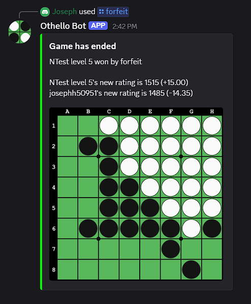
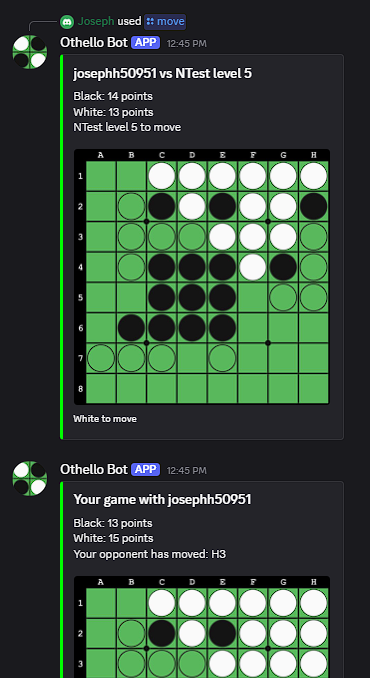
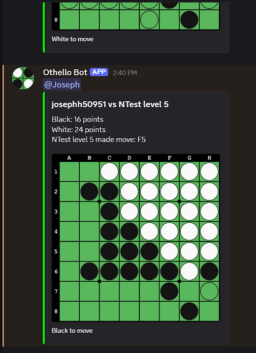
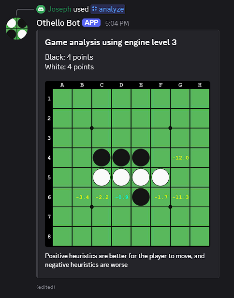

# Othellocord

Othellocord is a self-hosted Discord Bot used to play othello in discord text channels against other players or a bot.

It includes graphical interface to see the othello board and a database with statistics for each player.

Othellocord uses the NTest engine for bot gameplay and game analysis.

## Build

Install the NTest Othello Engine by using the MSI at this URL (https://web.archive.org/web/20131011003457/http://othellogateway.com/ntest/Ntest/), or by compiling it yourself

Install Dependencies
`go mod tidy`

Create a .env file
```
DISCORD_TOKEN=<your-bots-token>
DISCORD_APP_ID=<your-bots-api-key>
NTEST_PATH=C:\Program Files (x86)\Welty\NBoard\NTest.exe
```

Run the Tests
`$env:NTEST_PATH="C:\Program Files (x86)\Welty\NBoard\NTest.exe"; go test ./...`

Run the Program
`go run cmd/bot/main.go`

## Commands

`/challenge @user`

Challenges another user to an othello game. Another player can accept the challenge with the `/accept` discord.

`/challengebot level`

Challenges the bot to an othello game. The bot can be level 1–6, each level using a different depth 
(for the bot to feel snappy on level 6, you need very good hardware).

`/accept @user`

Accept a challenge from a user.

`/forfeit`

Forfeits the game currently being played.
<br>


`/move move`

Make a move on the current game. Move format is column-row.
<br>



`/view`

View the current board state the game the user is playing, and all available moves.

`/analyze level`

Performs an analysis on the current game. Displays the bot's heuristic ranking for each move.



`/stats`

Fetches the stats for the current user. Displays rating, win rate, wins, losses, and draws.

`/leaderboard`

Shows the top users with the highest elo in the entire database.

`/simulate`

Run a game between two bots real time in a text channel.
<br><br>
<a href="https://drive.google.com/file/d/1PCL-ekr0RS1c7hmFjZVrB6bj_-uqz2om/view" target="_blank">Watch a demo</a>

`/moves`

Displays all the move log for the current game.

